# Sequence Diagrams - @lazy-js/auth

This document contains detailed sequence diagrams illustrating the key workflows and interactions in the @lazy-js/auth system.

## Table of Contents

1. [User Registration Flow](#user-registration-flow)
2. [User Login Flow](#user-login-flow)
3. [Token Validation Flow](#token-validation-flow)
4. [Token Refresh Flow](#token-refresh-flow)
5. [Password Update Flow](#password-update-flow)
6. [Account Verification Flow](#account-verification-flow)
7. [Role Validation Flow](#role-validation-flow)
8. [System Initialization Flow](#system-initialization-flow)
9. [Error Handling Flow](#error-handling-flow)
10. [Multi-Client Authentication Flow](#multi-client-authentication-flow)

## User Registration Flow

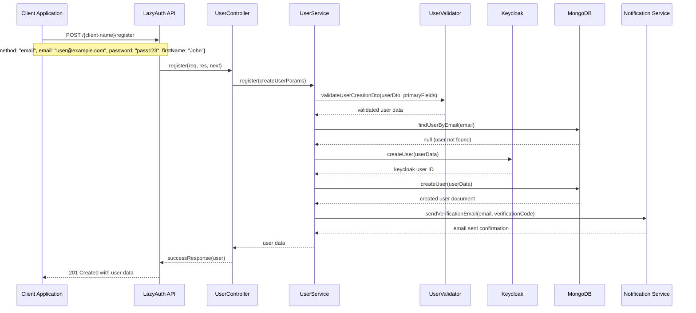

## User Login Flow

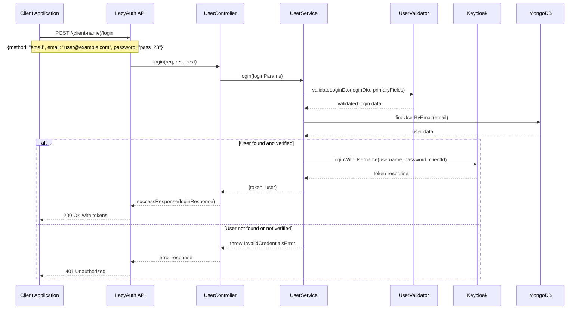

## Token Validation Flow

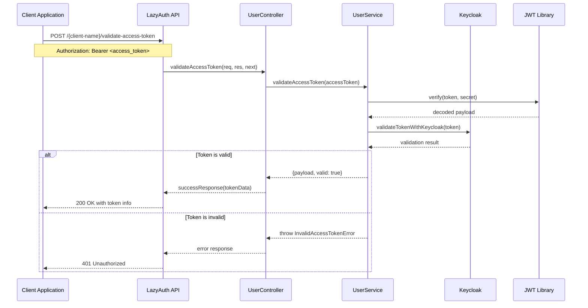

## Token Refresh Flow

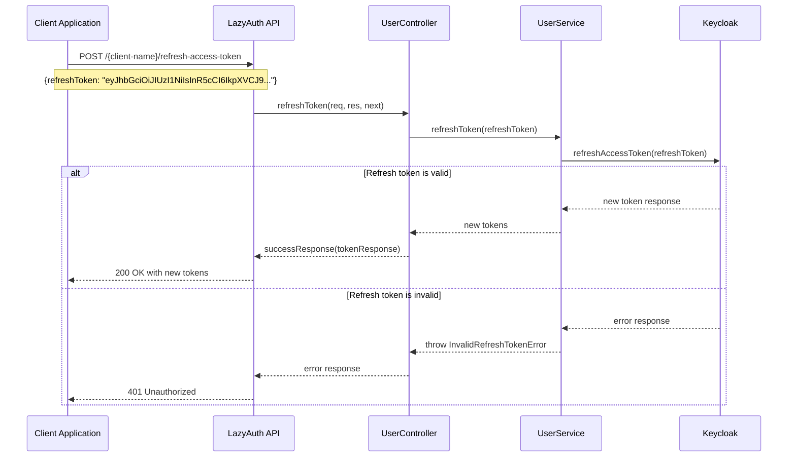

## Password Update Flow

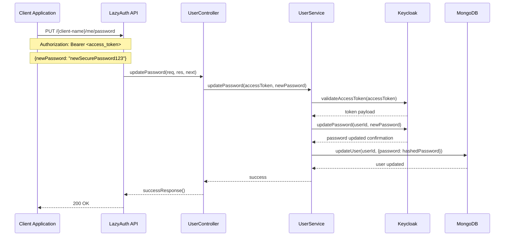

## Account Verification Flow

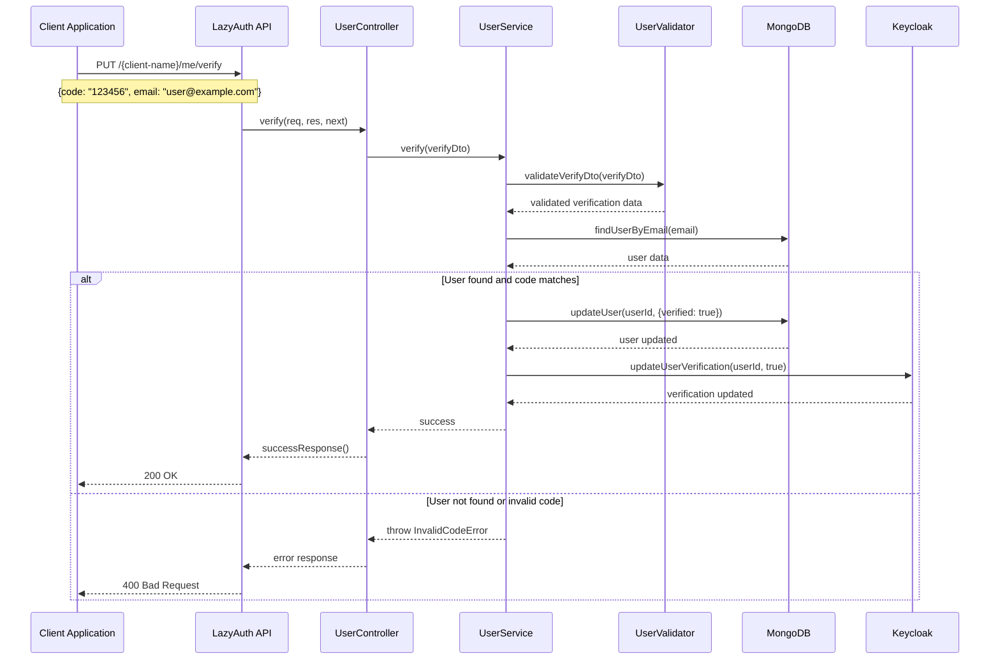

## Role Validation Flow

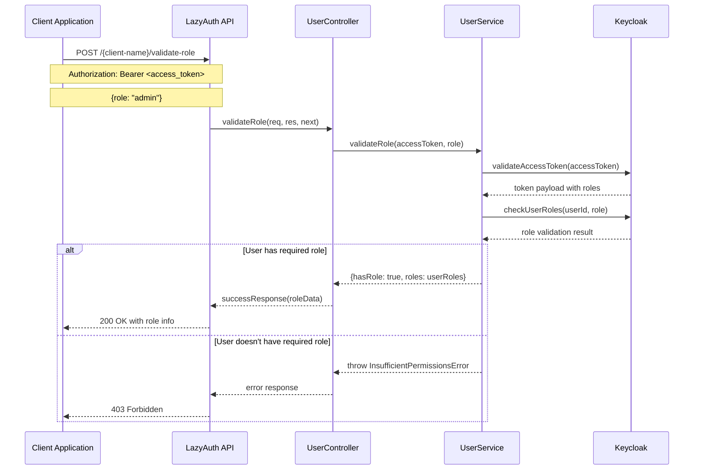

## System Initialization Flow

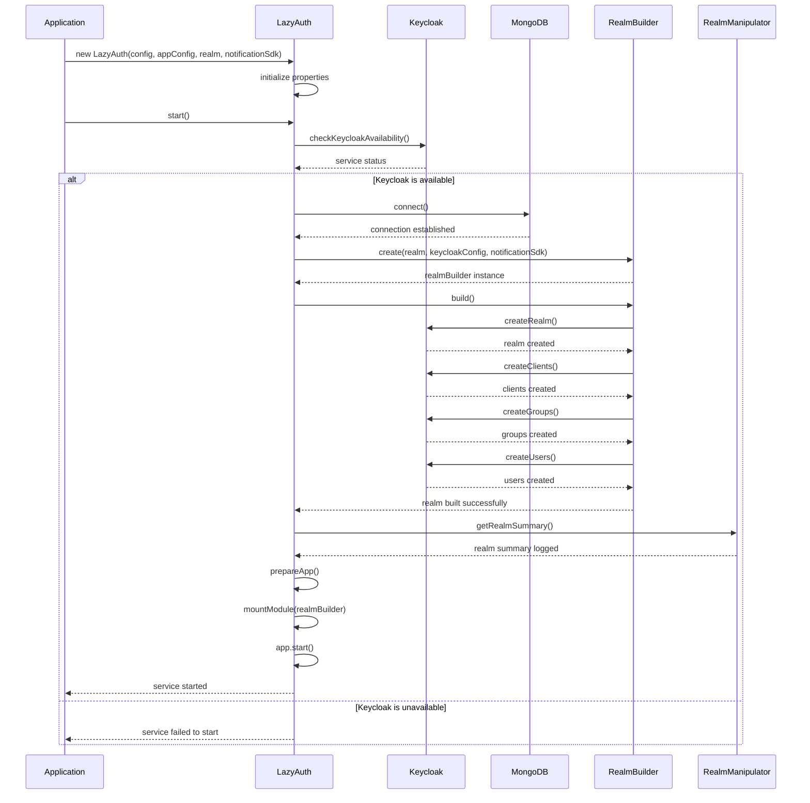

## Error Handling Flow

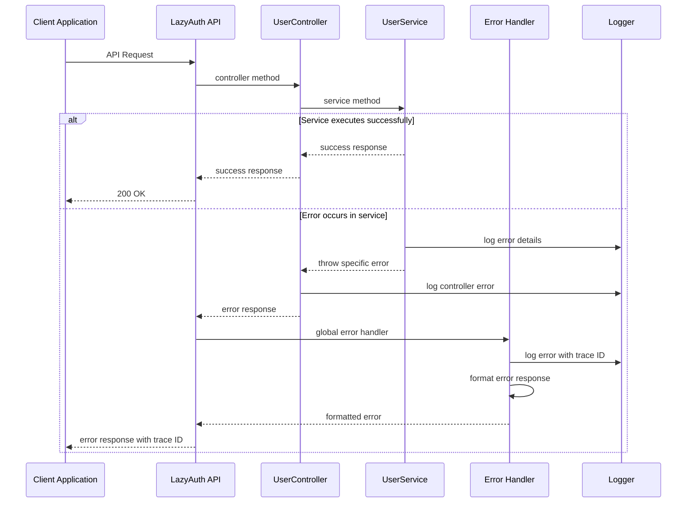

## Multi-Client Authentication Flow

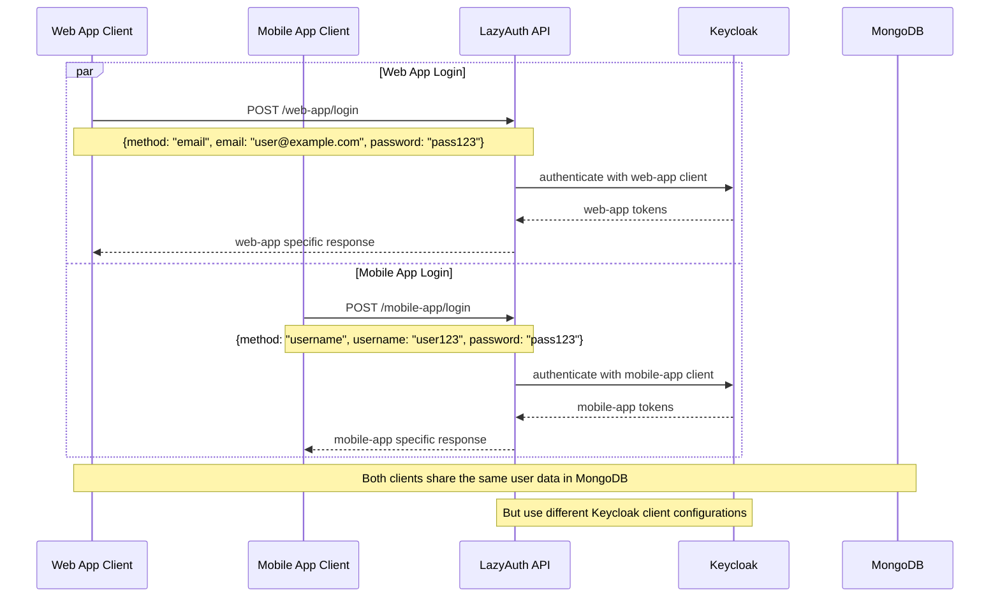

## Database Transaction Flow

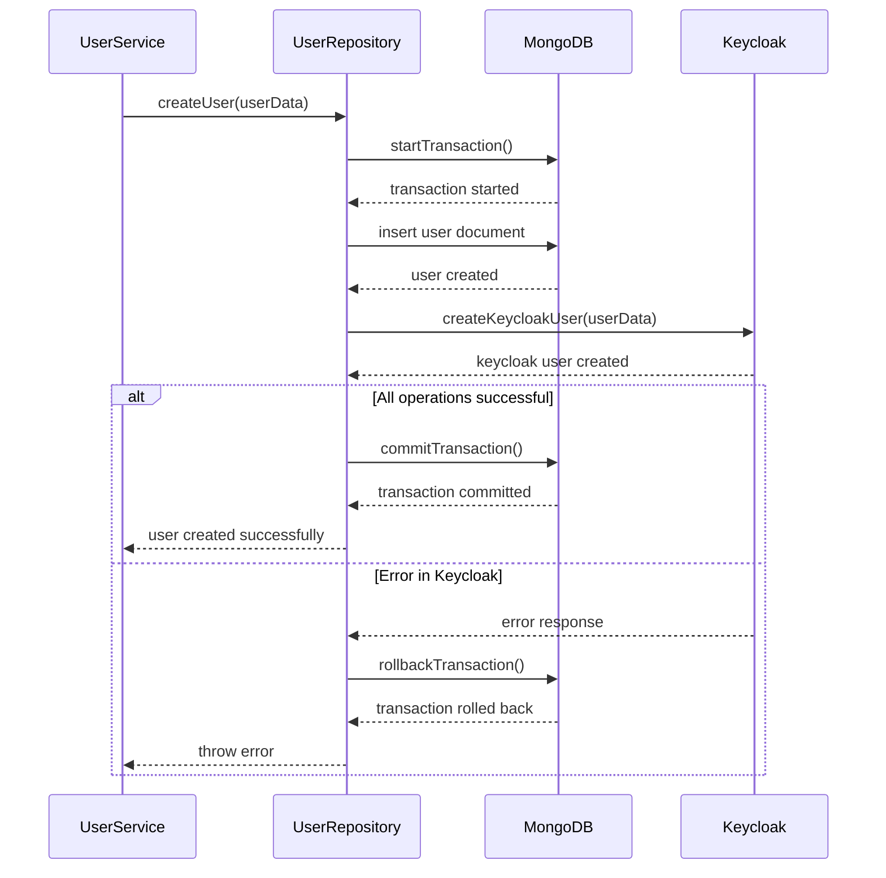

## Notification Flow

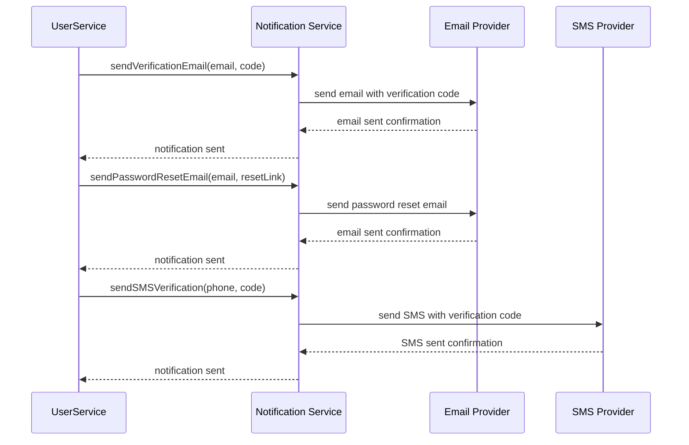

These sequence diagrams provide a comprehensive view of the key workflows and interactions within the @lazy-js/auth system, showing the detailed flow of data and control between different components.
